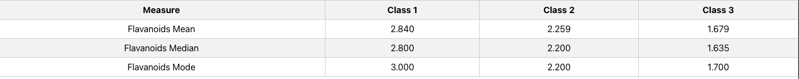

# Wine Statistics Project
---
## Description

This project calculates statistical measures of a Wine Data Set and displays the results in a React application. It includes two components, one for Flavanoids statistics and another for Gamma statistics.

## Table of Contents

- [Getting Started](#getting-started)
- [Project Structure](#project-structure)
- [Usage](#usage)
- [Screenshots](#screenshots)

---
## Getting Started

Follow these steps to set up and run the project on your local machine.

### Prerequisites

Before you begin, make sure you have the following installed:

- Node.js: [Download and install Node.js](https://nodejs.org/)
- Yarn: [Download and install Yarn](https://classic.yarnpkg.com/en/docs/install/)

### Installation

1. Clone the repository to your local machine:

   ```bash
   git clone https://github.com/iamrathin/wine-statistics.git
2. Navigate to the project directory:
    ```bash
    cd wine-statistics

## Installing project dependencies
Install project dependencies using Yarn:
### `yarn install`

## Running the Application

To run the React application, use the following command:

### `yarn start`

This will start the development server and open the application in your default web browser. 

You can access it at http://localhost:3000.

## Building the Project

If you want to build the project for production deployment, follow these steps:

Run the build command:

### `yarn build`
---
## Project Structure

The project follows the following folder structure:

src/: Contains the source code.

components/: React components.

utils/: Utility functions and data.

public/: Static assets and HTML template.

screenshots/: Contains screenshot of the two tables

interfaces/: Interface of the json data

styles/: common styling file for both table

---
## Usage

The application displays two statistical tables:

Flavanoids Statistics: Displays statistics for the Flavanoids property from the Wine Data Set.

Gamma Statistics: Displays statistics for the Gamma property calculated as Gamma = (Ash * Hue) / Magnesium.

Both tables are displayed on the home page.

---
## Screenshots
Flavanoid Table



Gamma Table

